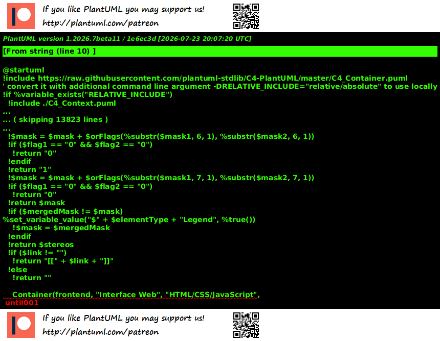

# Sistema de Controle de Custo de Produção de Vaca Parida e Cria

🌐 **Aplicação Web Online:**

https://pedromanoel.pythonanywhere.com/re

---

## Sobre o Projeto

Este projeto consiste no desenvolvimento de um sistema web para auxiliar no controle dos custos relacionados à produção de vacas paridas e suas crias.

A aplicação permite cadastrar animais, registrar custos relacionados ao manejo, suplementação mineral, medicamentos e alimentação, além de consultar os registros e relatórios de custos.

O sistema foi desenvolvido com o objetivo de facilitar o acompanhamento dos gastos da propriedade rural e organizar as informações utilizadas no processo de produção.

---

## Objetivo

Desenvolver uma aplicação web que possibilite:

- Cadastrar matrizes e bezerros;
- Registrar informações dos animais;
- Registrar despesas de manejo sanitário;
- Registrar despesas de suplementação mineral;
- Informar a quantidade utilizada na suplementação mineral;
- Registrar despesas com medicamentos;
- Registrar despesas com alimentação;
- Associar custos aos animais;
- Atualizar registros;
- Excluir registros;
- Consultar históricos de custos;
- Visualizar relatórios de custos.

---

## Público-alvo

O sistema foi desenvolvido principalmente para:

- Pequenos produtores rurais;
- Administradores de propriedades rurais;
- Técnicos agropecuários.

---

# Funcionalidades

## Cadastro de Animais

- Cadastro de matrizes;
- Cadastro de bezerros;
- Registro de brinco;
- Registro de raça;
- Registro de sexo;
- Registro de data de nascimento;
- Registro de peso;
- Registro de observações;
- Edição de animais;
- Exclusão de animais.

## Controle de Custos

O sistema permite registrar:

- Manejo sanitário;
- Suplementação mineral;
- Quantidade utilizada na suplementação mineral;
- Medicamentos;
- Alimentação.

Os custos podem ser associados a um animal específico ou registrados como custo geral da propriedade.

## Relatórios

O sistema permite consultar:

- Custos por categoria;
- Custos relacionados aos animais;
- Histórico dos lançamentos;
- Total dos custos registrados.

---

# Tecnologias Utilizadas

O projeto foi desenvolvido utilizando:

- **Python**
- **Flask**
- **SQLite**
- **HTML**
- **CSS**
- **Git**
- **GitHub**
- **PlantUML**
- **PythonAnywhere**

O **Flask** foi utilizado para o desenvolvimento da aplicação web.

O **SQLite** foi utilizado para armazenamento dos dados.

O **Git e GitHub** foram utilizados para controle de versão e organização do projeto.

O **PlantUML** foi utilizado para a criação dos diagramas da arquitetura.

O **PythonAnywhere** foi utilizado para disponibilizar a aplicação web publicamente.

---

# Metodologia

O desenvolvimento foi organizado a partir de histórias de usuário, permitindo identificar as necessidades dos usuários do sistema.

As tarefas foram organizadas utilizando o **GitHub Projects**, e o código foi versionado utilizando **Git e GitHub**.

A arquitetura e os processos do sistema foram documentados utilizando diagramas desenvolvidos em **PlantUML**.

Após o desenvolvimento e os testes, a aplicação foi disponibilizada na plataforma **PythonAnywhere**.

---

# Arquitetura do Sistema

A arquitetura do sistema foi documentada utilizando diagramas em PlantUML.

## Diagrama de Contexto



Arquivo PlantUML:

`contexto.puml`

---

## Diagrama de Contêiner — C4 Nível 2

O diagrama apresenta os principais componentes da aplicação e sua relação com o funcionamento do sistema.


Arquivo PlantUML:

`contexto_container.puml`

---

## Diagrama de Banco de Dados

O diagrama representa a estrutura dos dados utilizados pelo sistema.


Arquivo PlantUML:

`diagrama_banco.puml`

---

## Fluxograma do Processo de Cálculo

O fluxograma representa o processo relacionado ao controle e cálculo dos custos.


Arquivo PlantUML:

`fluxo_calculo.puml`

---

# Desenvolvedores

- **Emanuelle Cassol de Souza Godinho**
- **Luana Lopes Reis**
- **Pedro Manoel Rebelo Seti**

---

# Estrutura do Projeto

```text
vaca_parida/
│
├── app.py
├── modelos/
├── static/
├── README.md
├── README_EXECUCAO.md
├── requirements.txt
├── vaca_parida.db
│
├── contexto.puml
├── contexto_container.puml
├── contexto_container.png
├── diagrama_banco.puml
├── diagrama_banco.png
├── fluxo_calculo.puml
├── fluxo_calculo.png
└── docs/
