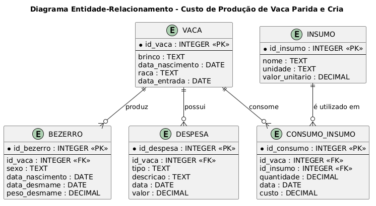
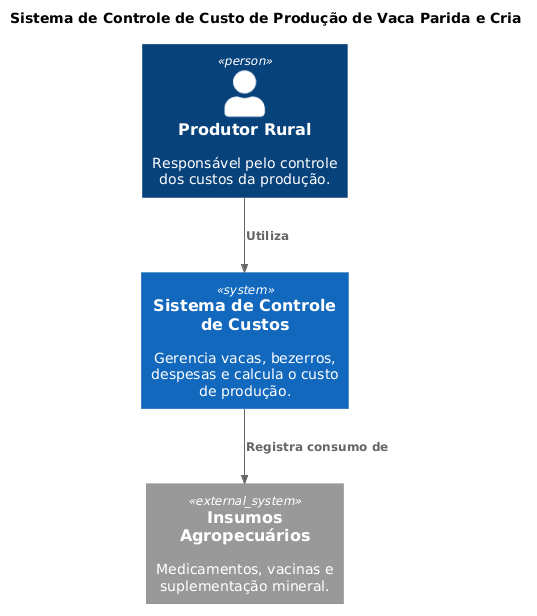
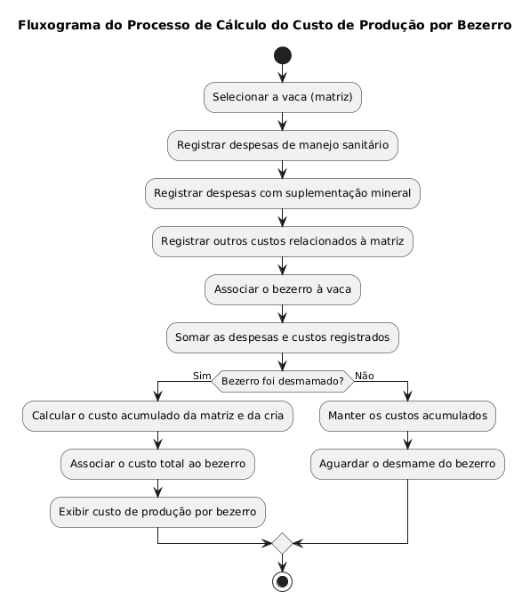

# Sistema de Controle de Custo de Produção de Vaca Parida e Cria

## Descrição

Este projeto consiste no desenvolvimento de um sistema para auxiliar produtores rurais no controle dos custos de produção de vacas paridas e suas crias até o desmame.

O sistema permite registrar despesas relacionadas ao manejo sanitário, suplementação mineral e demais custos da matriz, calculando automaticamente o custo acumulado por bezerro produzido. O objetivo é facilitar o controle financeiro da propriedade e apoiar a tomada de decisões.

---

## Objetivo

Desenvolver uma aplicação que possibilite:

- Cadastro de vacas (matrizes);
- Cadastro de bezerros;
- Registro de despesas de manejo;
- Registro de suplementação mineral;
- Cálculo automático do custo de produção por bezerro;
- Consulta de relatórios de custos.

---

## Público-alvo

- Pequenos produtores rurais;
- Administradores de fazendas;
- Técnicos agropecuários.

---

## Funcionalidades

### Cadastro

- Cadastrar vacas;
- Cadastrar bezerros;
- Associar o bezerro à sua matriz.

### Controle de Custos

- Registrar despesas sanitárias;
- Registrar suplementação mineral;
- Registrar medicamentos;
- Atualizar ou excluir despesas cadastradas.

### Consultas

- Consultar custos por vaca;
- Consultar custos por bezerro;
- Consultar despesas por período;
- Visualizar histórico de manejos.

### Relatórios

- Relatório de custo individual por vaca;
- Relatório de custo por bezerro;
- Relatório geral de custos da propriedade.

---

## Histórias de Usuário

### Francisco Silva (Produtor Rural)

> Como produtor rural, quero registrar as despesas da vaca parida e sua cria para acompanhar o custo de produção de cada bezerro.

### Orlando Oliveira (Administrador)

> Como administrador da fazenda, quero consultar relatórios de custos para analisar a rentabilidade das matrizes.

### Felipe Santos (Técnico Agropecuário)

> Como técnico agropecuário, quero registrar os manejos sanitários realizados para manter o histórico atualizado e calcular corretamente os custos.

---

## Tecnologias sugeridas

- Java
- MySQL
- JDBC
- Swing ou JavaFX
- Git
- GitHub

---

# Arquitetura do Sistema

A arquitetura do sistema foi planejada antes do início do desenvolvimento, com o objetivo de representar a estrutura técnica, os dados e os principais componentes envolvidos no funcionamento da aplicação.

Os diagramas foram desenvolvidos utilizando a linguagem **PlantUML** e estão disponíveis na raiz deste repositório em formato `.puml`.

## Diagrama Entidade-Relacionamento (DER)

O Diagrama Entidade-Relacionamento representa a estrutura dos dados que serão utilizados pelo sistema.

O modelo contempla informações relacionadas às vacas, bezerros, despesas, insumos e consumo de insumos, permitindo organizar os dados necessários para o controle dos custos de produção.

### Diagrama



**Arquivo PlantUML:** [diagrama_banco.puml](diagrama_banco.puml)

## Diagrama de Contexto (C4 - Nível 1)

Este diagrama representa a visão geral do sistema, mostrando o produtor rural como usuário principal e sua interação com o Sistema de Controle de Custo de Produção de Vaca Parida e Cria.

### Diagrama


**Arquivo PlantUML:** `contexto.puml`
---


# Arquitetura do Sistema

A arquitetura do sistema foi modelada utilizando **PlantUML**, permitindo documentar a estrutura técnica, o banco de dados e o fluxo do processo de cálculo do custo de produção da vaca parida e sua cria.

## Diagramas desenvolvidos

### Diagrama de Contexto (C4 Nível 1)

Representa a interação entre o produtor rural e o sistema.



Arquivo PlantUML: `contexto.puml`

### Diagrama de Banco de Dados (DER)

Representa as entidades do sistema, incluindo vacas, bezerros, despesas e insumos.


Arquivo PlantUML: `diagrama_banco.puml`

### Fluxograma do Processo do Agro

Representa o processo de cálculo do custo acumulado por bezerro produzido.



Arquivo PlantUML: `fluxo_calculo.puml`

## Responsáveis pelos diagramas

* **Diagrama de Contexto (C4 Nível 1):** [Nome do integrante]
* **Diagrama de Banco de Dados (DER):** Pedro Manoel Rebelo Seti
* **Fluxograma do Processo do Agro:** [Nome do integrante]

## Estrutura do Projeto

```text
src/
│
├── model/
├── dao/
├── controller/
├── view/
└── util/
