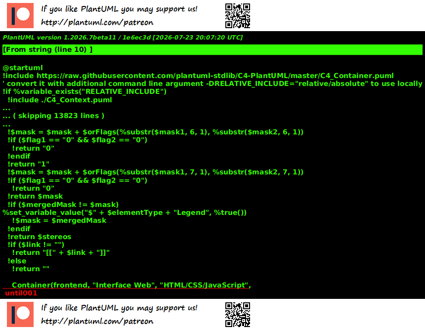
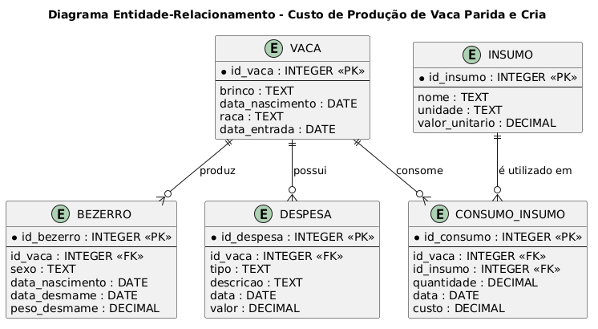
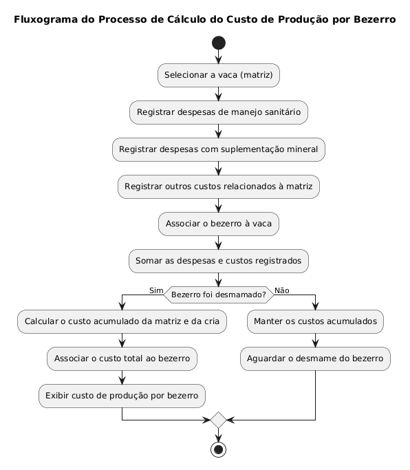

# Sistema de Controle de Custo de Produção de Vaca Parida e Cria

🌐 **Aplicação Web Online:**  
https://pedromanoel.pythonanywhere.com/re

---

## Sobre o Projeto

Este projeto consiste no desenvolvimento de um sistema web para auxiliar produtores rurais no controle dos custos de produção de vacas paridas e suas crias até o desmame.

A aplicação permite registrar informações relacionadas aos animais, despesas de manejo, suplementação mineral, medicamentos e alimentação, além de consultar os registros e relatórios de custos.

O sistema foi desenvolvido com o objetivo de facilitar o acompanhamento dos gastos da propriedade rural e organizar as informações relacionadas à produção.

---

## Objetivo

Desenvolver uma aplicação web que possibilite:

- Cadastrar vacas (matrizes);
- Cadastrar bezerros;
- Registrar informações dos animais;
- Registrar despesas de manejo sanitário;
- Registrar suplementação mineral;
- Registrar medicamentos;
- Registrar alimentação;
- Associar custos aos animais;
- Atualizar registros;
- Excluir registros;
- Consultar históricos de custos;
- Visualizar relatórios de custos.

---

## Público-alvo

O sistema foi desenvolvido principalmente para:

- Pequenos produtores rurais;
- Administradores de propriedades rurais;
- Técnicos agropecuários.

---

# Funcionalidades

## Cadastro de Animais

- Cadastro de matrizes;
- Cadastro de bezerros;
- Registro de brinco;
- Registro de raça;
- Registro de sexo;
- Registro de nascimento;
- Registro de peso;
- Registro de observações;
- Edição de animais;
- Exclusão de animais.

## Controle de Custos

O sistema permite registrar:

- Manejo sanitário;
- Suplementação mineral;
- Medicamentos;
- Alimentação.

Os custos podem ser associados a um animal específico ou registrados como custo geral da propriedade.

## Consultas e Relatórios

O sistema permite consultar:

- Custos por categoria;
- Custos relacionados aos animais;
- Histórico dos lançamentos;
- Total dos custos registrados;
- Relatórios de custos por animal.

---

# Histórias de Usuário

### Francisco Silva — Produtor Rural

> Como produtor rural, quero registrar as despesas da vaca parida e sua cria para acompanhar o custo de produção de cada bezerro.

### Orlando Oliveira — Administrador

> Como administrador da fazenda, quero consultar relatórios de custos para analisar os gastos relacionados às matrizes e suas crias.

### Felipe Santos — Técnico Agropecuário

> Como técnico agropecuário, quero registrar os manejos sanitários realizados para manter o histórico atualizado e contribuir para o controle correto dos custos.

---

# Tecnologias Utilizadas

O projeto foi desenvolvido utilizando:

- **Python**
- **Flask**
- **SQLite**
- **HTML**
- **CSS**
- **Git**
- **GitHub**
- **PlantUML**
- **PythonAnywhere**

O Flask foi utilizado para o desenvolvimento da aplicação web.

O SQLite foi utilizado para armazenamento dos dados.

O Git e o GitHub foram utilizados para controle de versão e organização do projeto.

O PlantUML foi utilizado para criação dos diagramas da arquitetura.

O PythonAnywhere foi utilizado para disponibilizar a aplicação web publicamente.

---

# Metodologia

O desenvolvimento foi organizado a partir de Histórias de Usuário, permitindo identificar as necessidades dos diferentes usuários do sistema.

As tarefas foram organizadas utilizando o **GitHub Projects**, enquanto o código foi versionado utilizando **Git e GitHub**.

A arquitetura do sistema foi documentada utilizando diagramas desenvolvidos em **PlantUML**.

Após o desenvolvimento, a aplicação foi disponibilizada na nuvem por meio do **PythonAnywhere**.

---

# Arquitetura do Sistema

A arquitetura do sistema foi documentada utilizando diagramas desenvolvidos em PlantUML.

## Diagrama de Contexto — C4 Nível 1

O Diagrama de Contexto apresenta uma visão geral do sistema e sua interação com o usuário.



Arquivo PlantUML:

`contexto.puml`

---

## Diagrama de Contêiner — C4 Nível 2

O Diagrama de Contêiner apresenta os principais componentes da aplicação e sua relação com o funcionamento do sistema.


Arquivo PlantUML:

`contexto_container.puml`

---

## Diagrama de Banco de Dados — DER

O Diagrama Entidade-Relacionamento representa a estrutura dos dados utilizados pelo sistema.



Arquivo PlantUML:

`diagrama_banco.puml`

---

## Fluxograma do Processo

O fluxograma representa o processo relacionado ao controle e cálculo dos custos da produção.



Arquivo PlantUML:

`fluxo_calculo.puml`

---

# Aplicação Online

A aplicação está hospedada no PythonAnywhere e pode ser acessada pelo endereço:

**https://pedromanoel.pythonanywhere.com/re**

O sistema disponibiliza funcionalidades de cadastro de animais, controle de custos, associação de despesas, consultas e relatórios.

---

# Documentação e Apresentação

Os arquivos de documentação e apresentação estão disponíveis no repositório.

O Pitch Deck está localizado em:

`docs/pitch_deck.pdf`

---

# Desenvolvedores

- **Emanuelle Cassol de Souza Godinho**
- **Luana Lopes Reis**
- **Pedro Manoel Rebelo Seti**

---

# Estrutura do Projeto

```text
vaca_parida/
│
├── app.py
├── modelos/
├── static/
├── templates/
├── docs/
│   └── pitch_deck.pdf
│
├── contexto.puml
├── contexto_container.puml
├── contexto_container.png
├── diagrama_banco.puml
├── diagrama_banco.png
├── fluxo_calculo.puml
├── fluxo_calculo.png
│
├── requirements.txt
└── README.md
